# Hexa Force: Architecture & Mitigation Handbook

This document provides visual architectural sequence diagrams for all 9 stages of the Hexa Force Containment Lab. 
Sequence diagrams are used to illustrate the precise chronological order of system calls, thread execution, and kernel subsystem interactions that lead to container escapes, as well as the exact interception points of the Hexa Force mitigation architecture.
I used Mermaid coding for the architecture design

---

##   Architectural Primitives
Before reviewing the stages, it is critical to understand the boundaries of the environment:
*   **Unprivileged Container:** A heavily restricted process space (Namespaces) isolated from the rest of the system.
*   **Host Kernel:** The core operating system layer shared by *all* containers. If the kernel is compromised, all containers and the host are compromised.
*   **Page Cache:** A region of Host Kernel memory used to temporarily store disk files for faster access. This is the primary target for modern memory-corruption escapes.
*   **Seccomp eBPF:** A kernel-level firewall that filters system calls (the instructions the container sends to the kernel) before they execute.

---

## Stage 1: Dirty COW (CVE-2016-5195)
*   **Mechanism:** Exploits a race condition in the page cache using the `madvise` system call.
*   **Severity:** CVSS v3 7.8 (HIGH)
*   **Vulnerable Kernels:** Linux Kernel < 4.8.3

### Attack Architecture
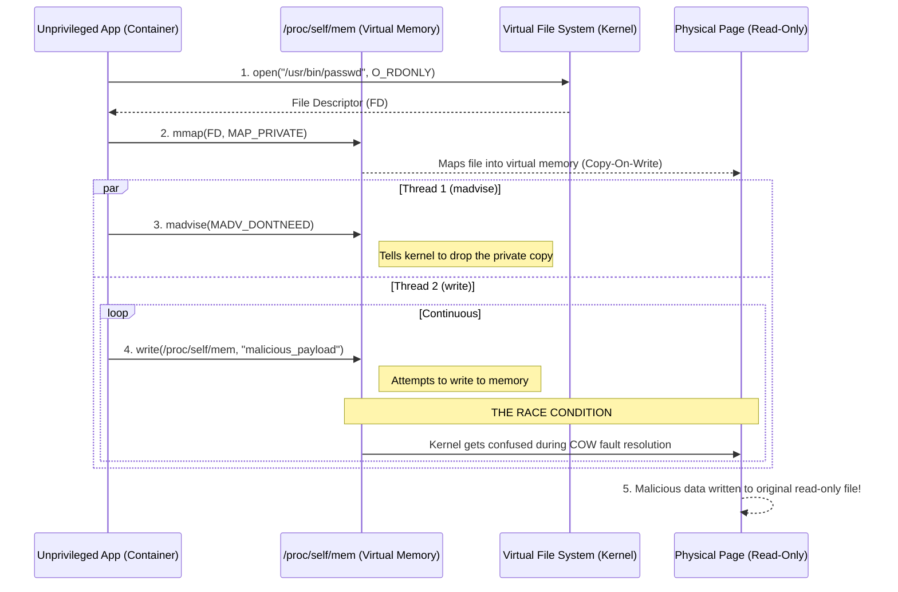
**Explanation:** The attacker opens a read-only file and maps it into virtual memory. By rapidly telling the kernel they "don't need" the memory (`madvise`) while simultaneously trying to write to it, the kernel gets confused. This race condition causes the kernel to accidentally write the malicious data into the physical read-only file on the host.

### Mitigation Architecture
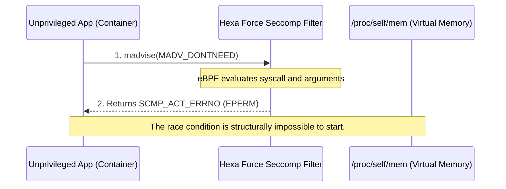
**Explanation:** Hexa Force uses Seccomp eBPF to monitor system calls. When it sees the container trying to use the dangerous `madvise` function, it instantly blocks it and returns a "Permission Denied" (EPERM) error. Without `madvise`, the race condition cannot begin.
*   **Mitigation Trade-off (Performance/Utility):** Blocking `madvise` entirely can degrade performance for legitimate database applications (like Redis or PostgreSQL) that use it for memory optimization.

---

## Stage 1B: Dirty Pipe (CVE-2022-0847)
*   **Mechanism:** Exploits uninitialized pipe flags using the `splice` system call.
*   **Severity:** CVSS v3 7.8 (HIGH)
*   **Vulnerable Kernels:** Linux Kernel 5.8 through 5.16.11

### Attack Architecture
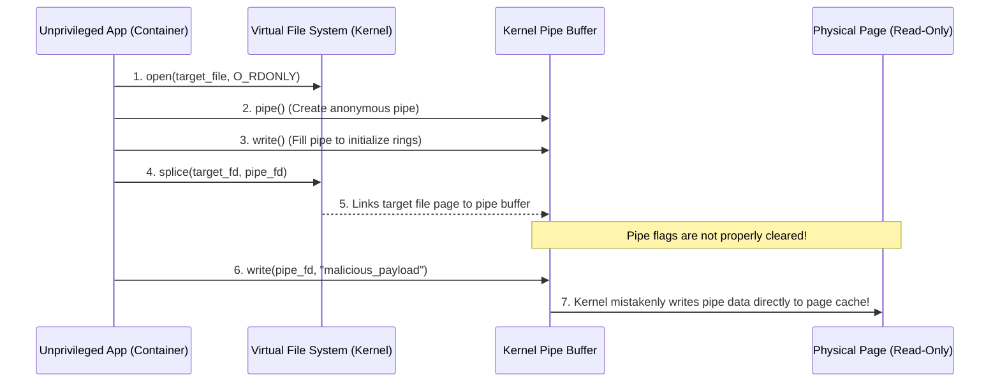
**Explanation:** The attacker creates a network pipe, filling it with data to leave hidden "flags" active. They use the `splice` command to connect a read-only file to that pipe. Because the kernel forgot to clear those flags, anything written into the pipe is injected straight into the host's read-only file.

### Mitigation Architecture
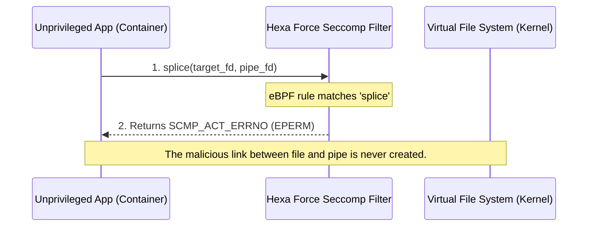
**Explanation:** By applying a Seccomp filter that denies access to the `splice` system call, the container is physically incapable of linking the pipe buffer to the file.
*   **Mitigation Trade-off (Performance/Utility):** `splice` is heavily used for "zero-copy" network operations. Blocking it may reduce I/O throughput for high-performance web servers (like NGINX or HAProxy).

---

## Stage 1C: Copy Fail (CVE-2026-31431)
*   **Mechanism:** Exploits cryptographic subsystems using `AF_ALG` sockets.
*   **Severity:** CVSS v3 8.1 (HIGH)
*   **Vulnerable Kernels:** 2026 Kernel Branches

### Attack Architecture
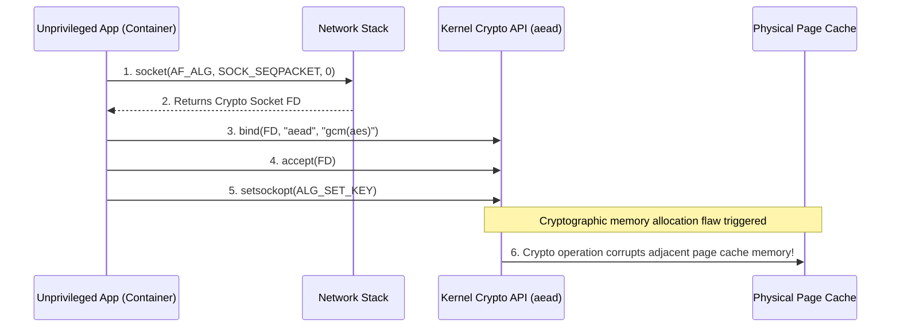
**Explanation:** The attacker creates a special socket (`AF_ALG`) to access the Linux kernel's internal cryptography engine. Feeding it a malicious key triggers a memory allocation bug, causing the crypto engine to overwrite adjacent page cache blocks.

### Mitigation Architecture
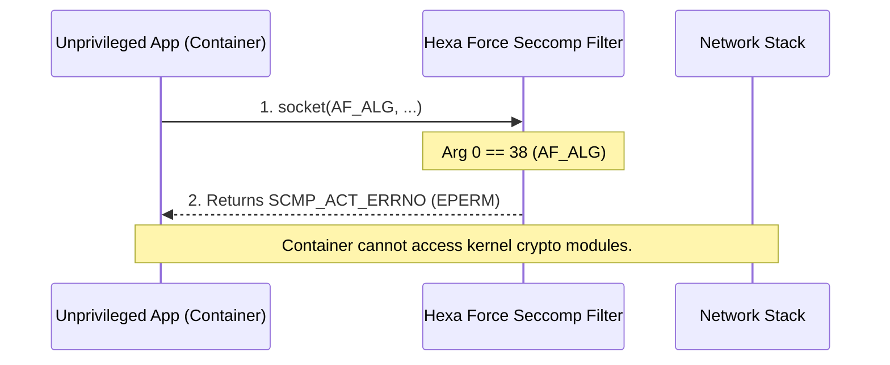
**Explanation:** Hexa Force's Seccomp profile deep-inspects the `socket` call. If it detects an attempt to create an `AF_ALG` (38) socket, it blocks it.
*   **Mitigation Trade-off (Performance/Utility):** Blocking `AF_ALG` prevents userspace applications from offloading cryptographic tasks to dedicated hardware (like AES-NI accelerators), increasing CPU load for encryption.

---

## Stage 1D: Dirty Frag (CVE-2026-43284)
*   **Mechanism:** Exploits IPv6 fragmentation logic via raw sockets.
*   **Severity:** CVSS v3 8.8 (HIGH)
*   **Vulnerable Kernels:** 2026 Kernel Branches

### Attack Architecture
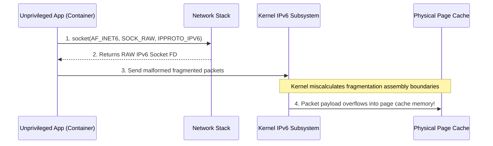
**Explanation:** The attacker uses a RAW network socket to send intentionally fragmented IPv6 packets. A calculation error during kernel reassembly causes the packet data to overflow the buffer and corrupt the page cache.

### Mitigation Architecture
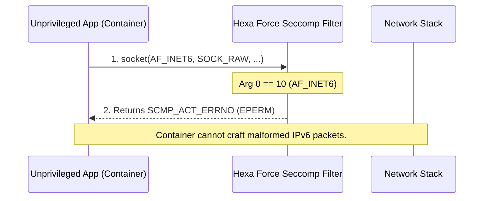
**Explanation:** Hexa Force intercepts the `socket` call and blocks argument `10` (`AF_INET6`), preventing raw IPv6 socket creation.
*   **Mitigation Trade-off (Performance/Utility):** Blocking RAW sockets prevents standard network diagnostic tools (like `ping6` or `traceroute`) from functioning inside the container.

---

## Stage 1E: Fragnesia (CVE-2026-46300)
*   **Mechanism:** Exploits the ESP-in-TCP Upper Layer Protocol subsystem.
*   **Severity:** CVSS v3 8.1 (HIGH)
*   **Vulnerable Kernels:** 2026 Kernel Branches

### Attack Architecture
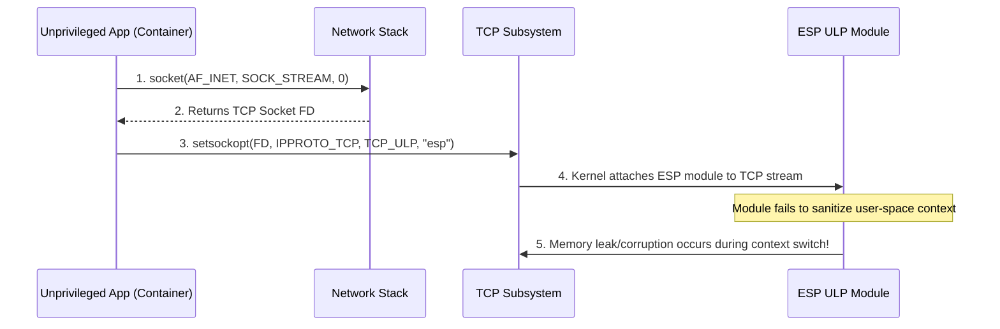
**Explanation:** An attacker creates a TCP connection and forces the kernel to attach an advanced security protocol (`esp`) via `setsockopt`. A context-switching bug leaks memory into the host system.

### Mitigation Architecture
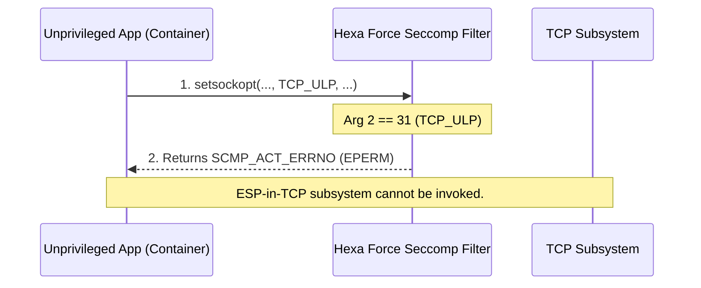
**Explanation:** Hexa Force strictly denies the `TCP_ULP` option (`31`), physically barring the `esp` protocol attachment.
*   **Mitigation Trade-off (Performance/Utility):** Prevents containers from utilizing advanced in-kernel TCP offloading capabilities (like kernel TLS or IPSec encapsulation).

---

## Stage 2: Namespace & Capabilities Isolation
*   **Mechanism:** Exploits excessive privileges (`CAP_SYS_PTRACE`, `--pid=host`).
*   **Severity:** Operational Misconfiguration (CRITICAL Risk)

### Attack Architecture
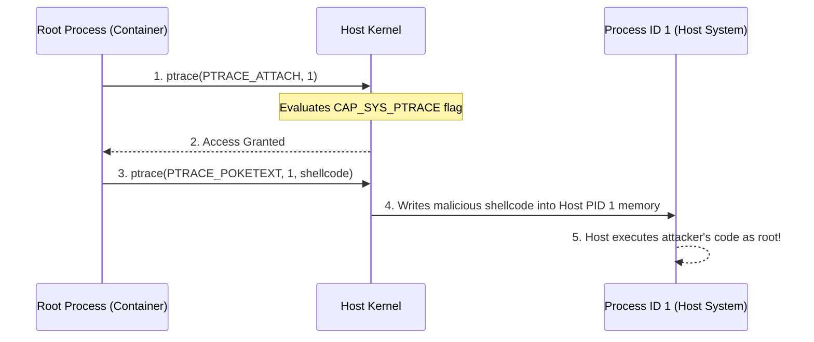
**Explanation:** A container with `SYS_PTRACE` privileges can attach a debugger to host processes (PID 1) and force them to execute malware.

### Mitigation Architecture
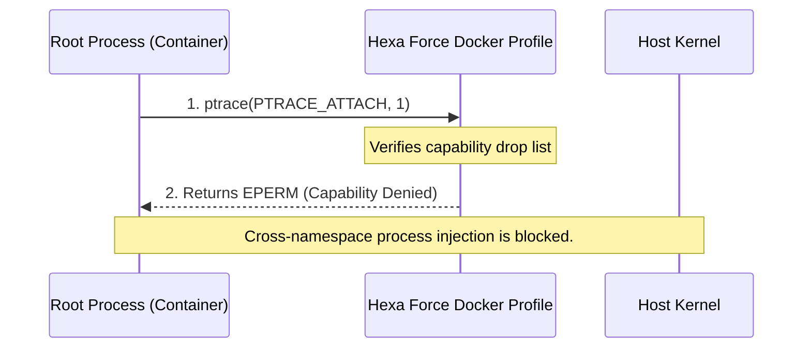
**Explanation:** Enforcing strict Docker defaults and dropping dangerous capabilities neutralizes the attack.
*   **Mitigation Trade-off (Performance/Utility):** Developers cannot use legitimate debugging tools (`gdb`, `strace`) on running applications inside the container.

---

## Stage 3: Daemon API Security
*   **Mechanism:** Exploits an exposed `/var/run/docker.sock`.
*   **Severity:** Operational Misconfiguration (CRITICAL Risk)

### Attack Architecture
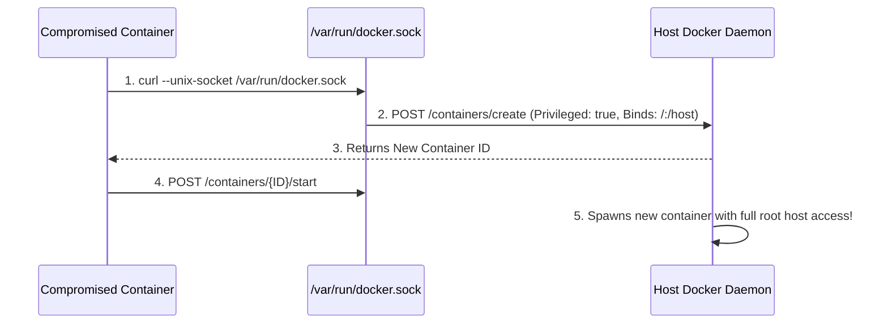
**Explanation:** An attacker sends HTTP commands to an exposed Docker socket, instructing the host to build a highly privileged backdoor container.

### Mitigation Architecture
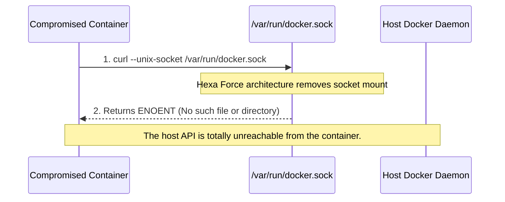
**Explanation:** Architectural isolation (never mounting the socket) prevents the API connection.
*   **Mitigation Trade-off (Performance/Utility):** Prevents "Docker-in-Docker" (DinD) architectures heavily used in CI/CD pipelines (like Jenkins or GitLab runners) from functioning.

---

## Stage 4: Persistent Mounts & Filesystem
*   **Mechanism:** Exploits writable host directories (e.g., `/etc/cron.d`).
*   **Severity:** Operational Misconfiguration (HIGH Risk)

### Attack Architecture
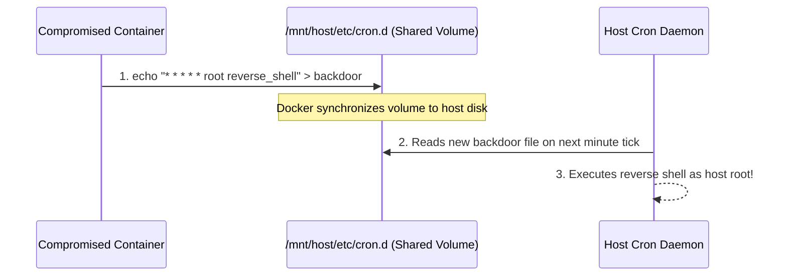
**Explanation:** Writing a malicious file to a shared cron directory forces the host operating system to execute it automatically.

### Mitigation Architecture
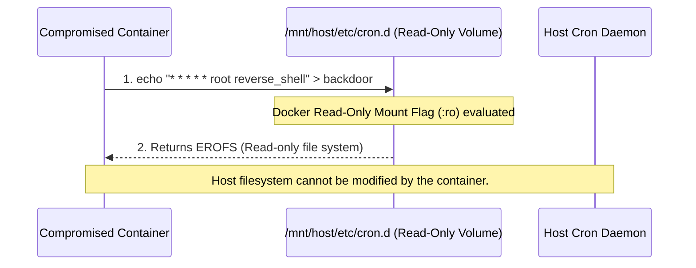
**Explanation:** Applying Read-Only (`:ro`) mount flags enforces an immutable infrastructure.
*   **Mitigation Trade-off (Performance/Utility):** Applications cannot write state, logs, or cache to disk unless explicitly mapped to temporary memory (`tmpfs`), complicating stateless architectures.

---

## Stage 5: MITRE ATT&CK Matrix Visualization
*   **Mechanism:** Translating 1 Vulnerability Mechanism into 4 Distinct Attack Tactics.

### 4x4 Threat Model Architecture
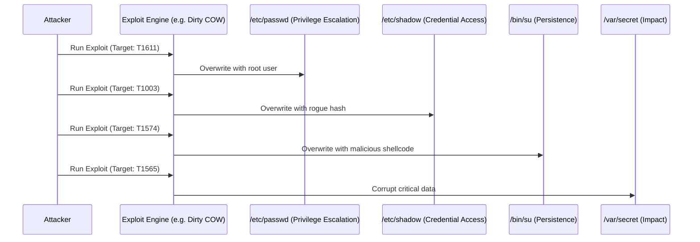
**Explanation:** This diagram proves that "breaking the kernel" is just the first step. Depending on the targeted file, the attacker achieves entirely different operational objectives defined by the globally recognized MITRE ATT&CK framework.
