# Hexa Force: Architecture & Mitigation Handbook

This document provides visual architectural sequence diagrams for all 9 stages of the Hexa Force Containment Lab. 
Sequence diagrams are used to illustrate the precise chronological order of system calls, thread execution, and kernel subsystem interactions that lead to container escapes, as well as the exact interception points of the Hexa Force mitigation architecture.

---

## Stage 1: Dirty COW (CVE-2016-5195)
**Mechanism:** Exploits a race condition in the page cache using the `madvise` system call.

### Attack Architecture
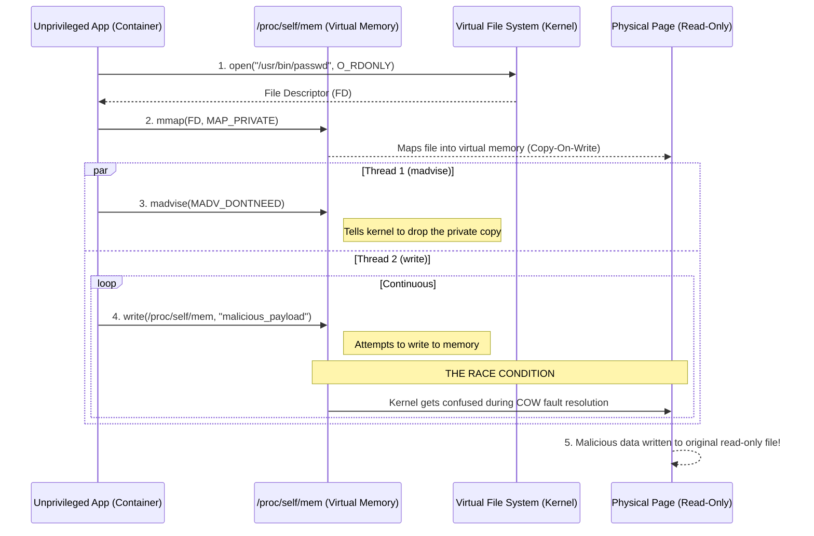
**Explanation:** The attacker opens a read-only file (like passwords) and maps it into virtual memory. By rapidly telling the kernel they "don't need" the memory (madvise) while simultaneously trying to write to it in a parallel thread, the kernel gets confused. This race condition causes the kernel to accidentally write the malicious data into the actual physical read-only file on the host.

### Mitigation Architecture
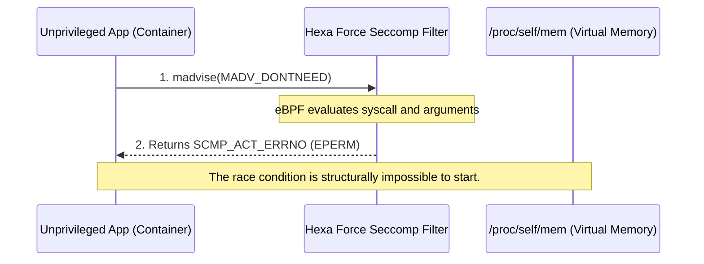
**Explanation:** Our Hexa Force firewall uses Seccomp eBPF to monitor all system calls. When it sees the container trying to use the dangerous `madvise` function, it instantly blocks it and returns a "Permission Denied" (EPERM) error. Without `madvise`, the race condition cannot even begin.

---

## Stage 1B: Dirty Pipe (CVE-2022-0847)
**Mechanism:** Exploits uninitialized pipe flags using the `splice` system call.

### Attack Architecture
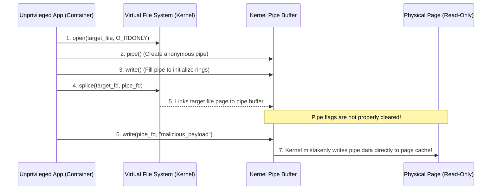
**Explanation:** The attacker creates a network pipe and fills it with data, leaving hidden "flags" active in the kernel. They then use the `splice` command to connect a read-only file to that pipe. Because the kernel forgot to clear those hidden flags, anything the attacker writes into the pipe is mistakenly injected straight into the read-only file on the host.

### Mitigation Architecture
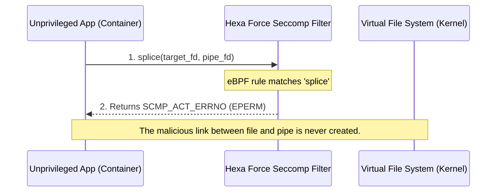
**Explanation:** By applying a Seccomp filter that completely denies access to the `splice` system call, the container is physically incapable of linking the pipe buffer to the file, neutralizing the Dirty Pipe exploit entirely.

---

## Stage 1C: Copy Fail (CVE-2026-31431)
**Mechanism:** Exploits cryptographic subsystems using `AF_ALG` sockets.

### Attack Architecture
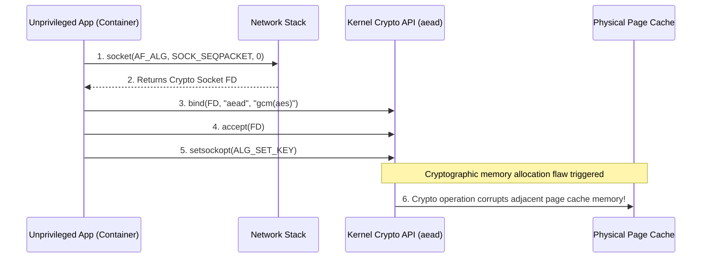
**Explanation:** The attacker abuses the Linux kernel's internal cryptography engine. By creating a special socket (`AF_ALG`) and feeding it a malicious encryption key, a bug in the kernel's memory allocation causes the crypto engine to overwrite adjacent memory blocks, corrupting the host page cache.

### Mitigation Architecture
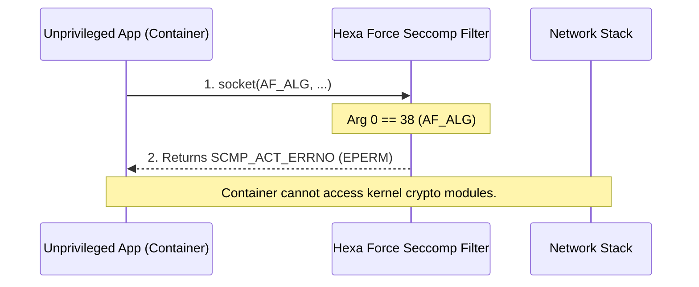
**Explanation:** The Hexa Force Seccomp profile looks deep into the `socket` system call. If it detects the container trying to create a socket belonging to family `38` (which is `AF_ALG`), it immediately blocks it, cutting off access to the vulnerable crypto subsystem.

---

## Stage 1D: Dirty Frag (CVE-2026-43284)
**Mechanism:** Exploits IPv6 fragmentation logic via raw sockets.

### Attack Architecture
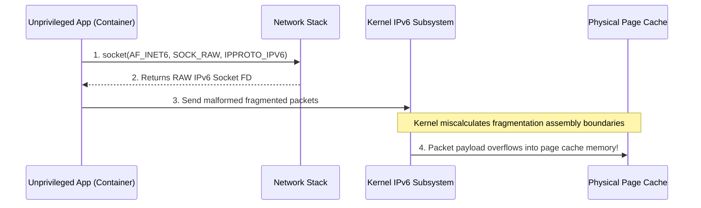
**Explanation:** The attacker creates a low-level RAW network socket and intentionally sends malformed, fragmented IPv6 packets to the kernel. When the kernel tries to reassemble these broken packets, a calculation error causes the packet data to overflow out of the network buffer and into the host's protected page cache memory.

### Mitigation Architecture
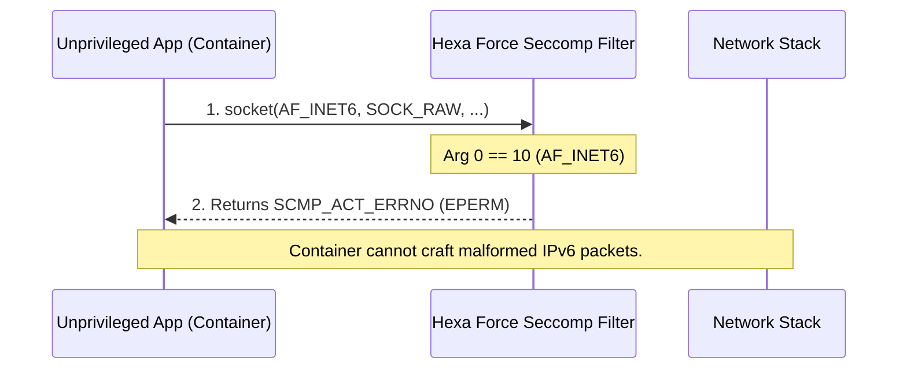
**Explanation:** Normal containers do not need RAW IPv6 networking privileges. Hexa Force intercepts the `socket` call and blocks argument `10` (`AF_INET6`), preventing the attacker from crafting the raw packets required to trigger the overflow.

---

## Stage 1E: Fragnesia (CVE-2026-46300)
**Mechanism:** Exploits the ESP-in-TCP Upper Layer Protocol subsystem.

### Attack Architecture
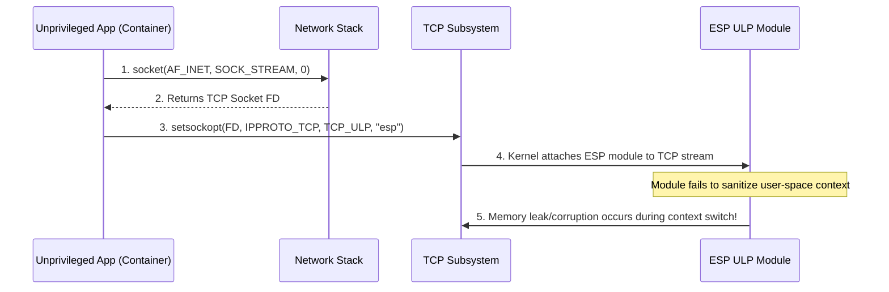
**Explanation:** The attacker creates a normal TCP network connection but then attempts to forcefully attach an advanced security protocol (`esp`) to the connection. A bug in how the kernel switches contexts for this protocol causes it to leak memory into the host system.

### Mitigation Architecture
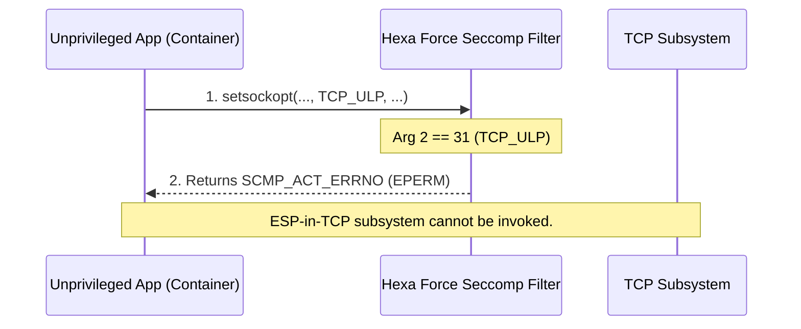
**Explanation:** Hexa Force uses deep argument inspection on the `setsockopt` command. It allows normal network configurations but strictly denies option `31` (`TCP_ULP`), rendering the attacker completely unable to attach the vulnerable `esp` protocol to their socket.

---

## Stage 2: Namespace & Capabilities Isolation
**Mechanism:** Exploits excessive privileges (`CAP_SYS_PTRACE`, `--pid=host`) to inject code.

### Attack Architecture
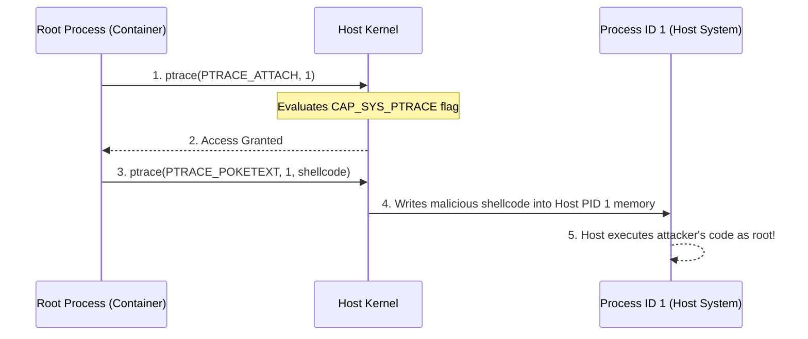
**Explanation:** If a container is launched with excessive Linux capabilities (like `SYS_PTRACE`) and shares the host's Process ID space, an attacker inside the container can literally attach a debugger to the host's core operating system processes (PID 1) and force them to execute malicious code.

### Mitigation Architecture
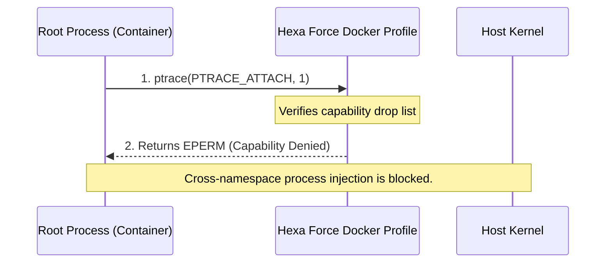
**Explanation:** By ensuring strict Docker defaults and dropping dangerous capabilities, the container environment strips the attacker of the right to use debugging tools (`ptrace`), making it impossible to latch onto host processes.

---

## Stage 3: Daemon API Security
**Mechanism:** Exploits an exposed `/var/run/docker.sock` to hijack the host daemon.

### Attack Architecture
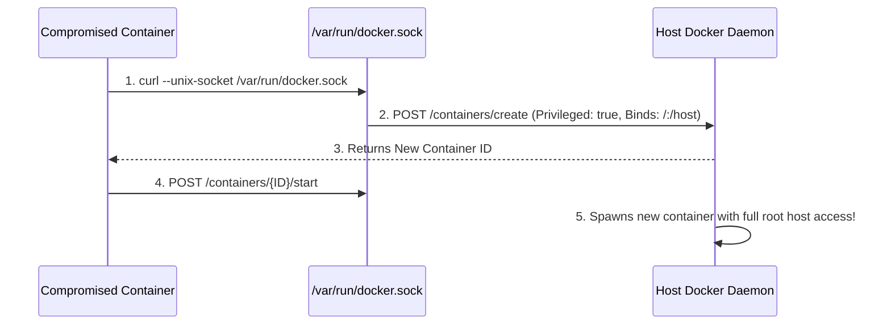
**Explanation:** Sometimes administrators accidentally leave the Docker management socket inside the container. An attacker can simply talk to this socket via HTTP and command the host server to build them a brand new, highly privileged container that has total control over the host.

### Mitigation Architecture
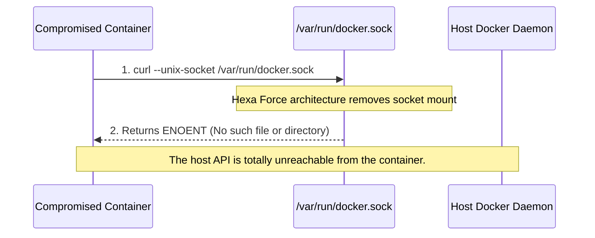
**Explanation:** The mitigation is architectural isolation. By never mounting the daemon socket into untrusted containers (or by enforcing strictly authenticated TCP/TLS sockets instead of UNIX sockets), the attacker has no physical path to communicate with the host API.

---

## Stage 4: Persistent Mounts & Filesystem
**Mechanism:** Exploits a writable host directory (e.g., `/etc/cron.d`) mounted into the container.

### Attack Architecture
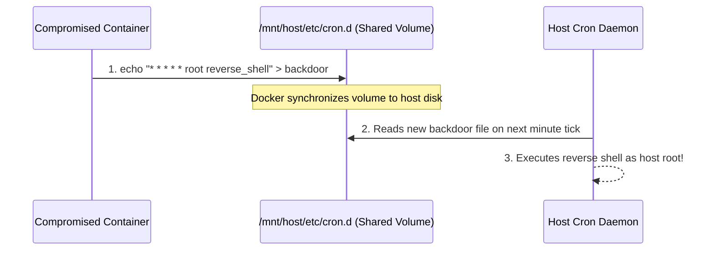
**Explanation:** If a container is given read/write access to sensitive host directories (like the cron job folder), the attacker can just write a text file containing malicious commands. Because the folder is shared, the host operating system immediately sees the file and executes the commands automatically.

### Mitigation Architecture
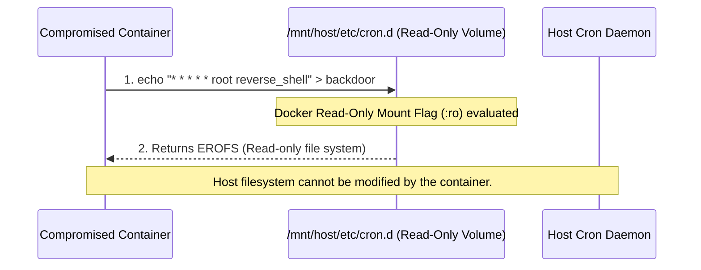
**Explanation:** The Hexa Force architecture dictates that any host directories mounted into a container must use the Read-Only (`:ro`) flag. This enforces an immutable infrastructure where the attacker is physically blocked from saving their malicious cron jobs to the disk.

---

## Stage 5: MITRE ATT&CK Matrix Visualization
**Mechanism:** 1 Vulnerability Mechanism -> 4 Distinct Attack Tactics.

### 4x4 Threat Model Architecture
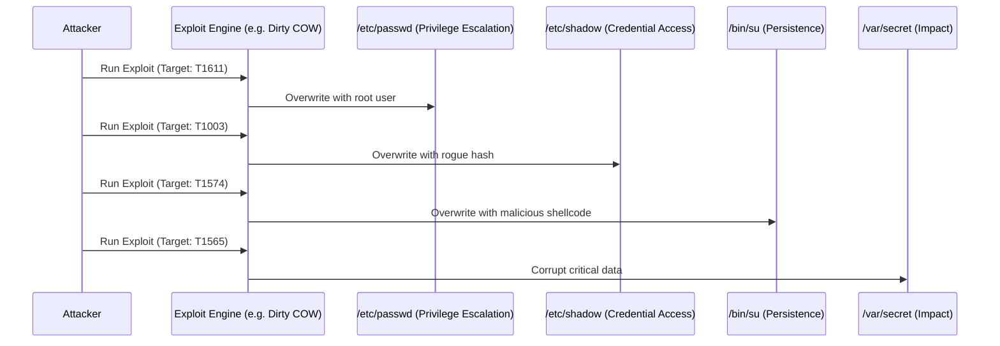
**Explanation:** This diagram proves to the classroom that "breaking the kernel" is just the first step. Depending on what file the attacker chooses to overwrite after they break the kernel, they achieve entirely different objectives within the globally recognized MITRE ATT&CK framework—from stealing passwords to destroying applications.
