# Hexa Force: Architecture & Mitigation Handbook

This document provides visual architectural diagrams for all 9 stages of the Hexa Force Containment Lab. 
For each stage, two diagrams are presented:
1.  **Attack Architecture:** How the vulnerability bypasses the container boundaries.
2.  **Mitigation Architecture:** How the Hexa Force architecture intercepts and neutralizes the attack.

---

## Stage 1: Dirty COW (CVE-2016-5195)
**Mechanism:** Exploits a race condition in the page cache using the `madvise` system call.

### Attack Architecture
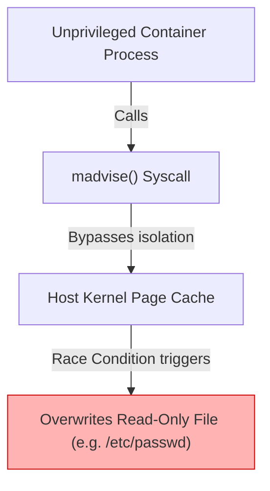

### Mitigation Architecture
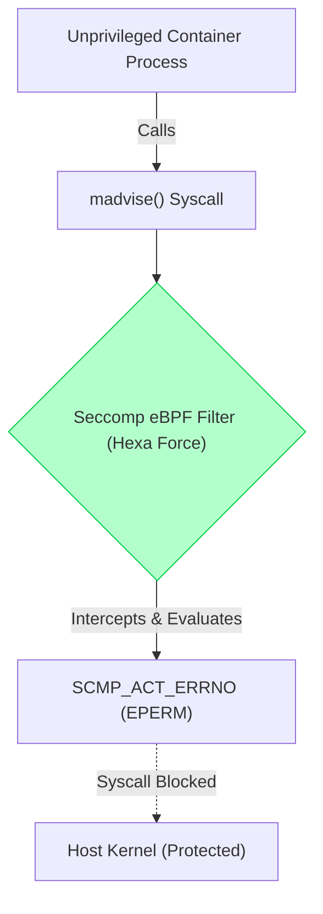

---

## Stage 1B: Dirty Pipe (CVE-2022-0847)
**Mechanism:** Exploits uninitialized pipe flags using the `splice` system call.

### Attack Architecture
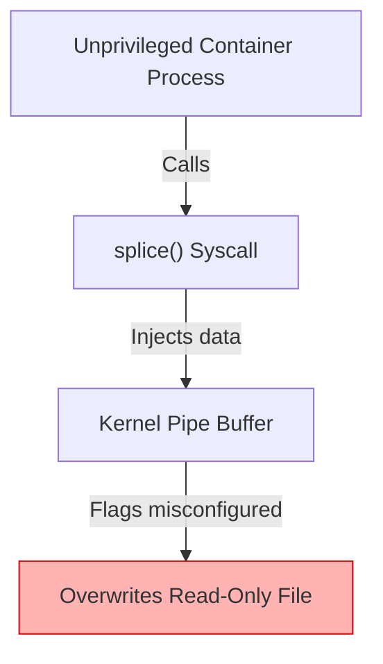

### Mitigation Architecture
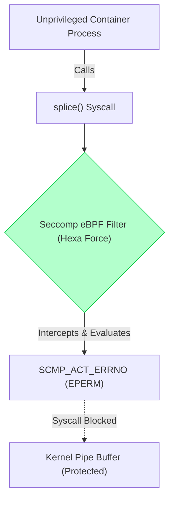

---

## Stage 1C: Copy Fail (CVE-2026-31431)
**Mechanism:** Exploits cryptographic subsystems using `AF_ALG` sockets.

### Attack Architecture
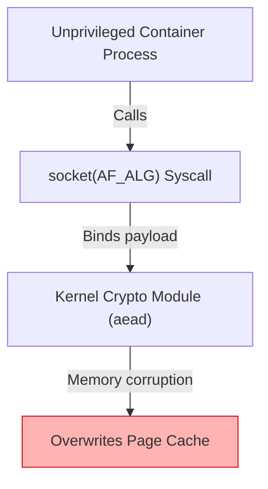

### Mitigation Architecture
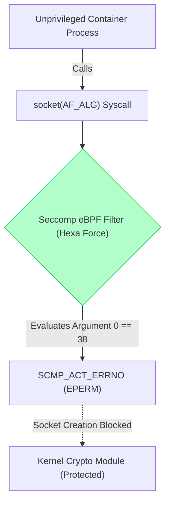

---

## Stage 1D: Dirty Frag (CVE-2026-43284)
**Mechanism:** Exploits IPv6 fragmentation logic via raw sockets.

### Attack Architecture
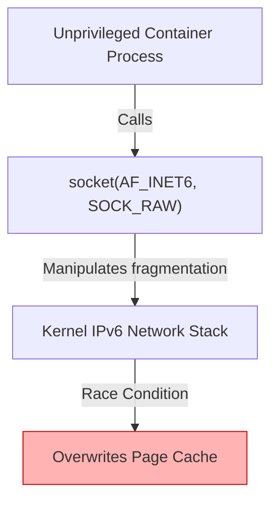

### Mitigation Architecture
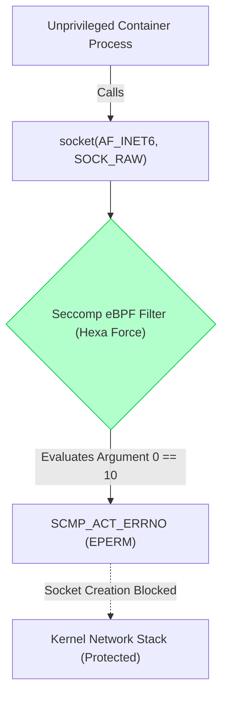

---

## Stage 1E: Fragnesia (CVE-2026-46300)
**Mechanism:** Exploits the ESP-in-TCP Upper Layer Protocol subsystem.

### Attack Architecture
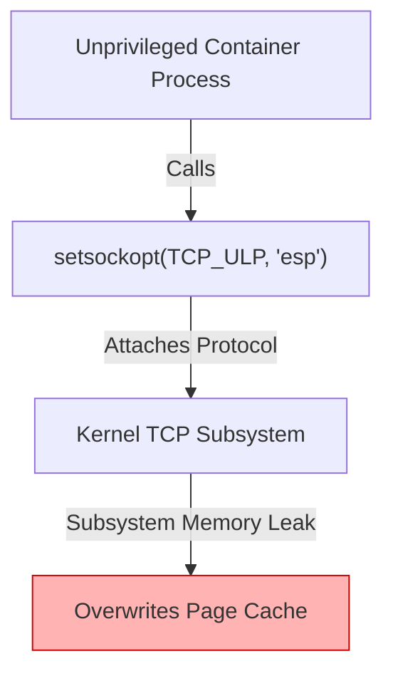

### Mitigation Architecture
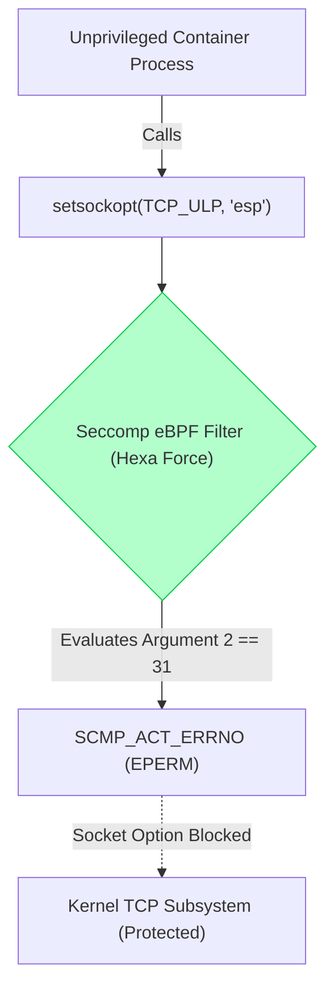

---

## Stage 2: Namespace & Capabilities Isolation
**Mechanism:** Exploits excessive privileges (`CAP_SYS_PTRACE`, `--pid=host`) to inject code into host processes.

### Attack Architecture
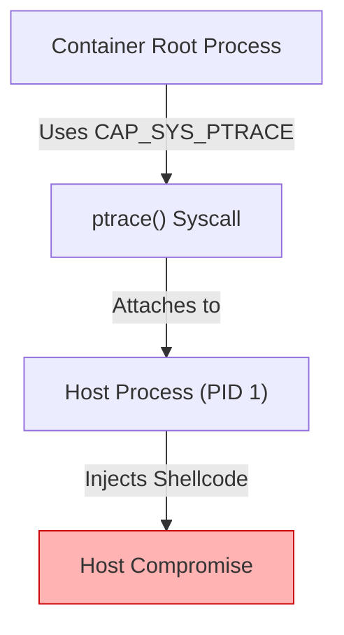

### Mitigation Architecture
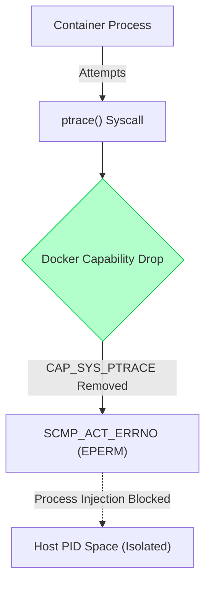

---

## Stage 3: Daemon API Security
**Mechanism:** Exploits an exposed `/var/run/docker.sock` to spin up a privileged rogue container.

### Attack Architecture
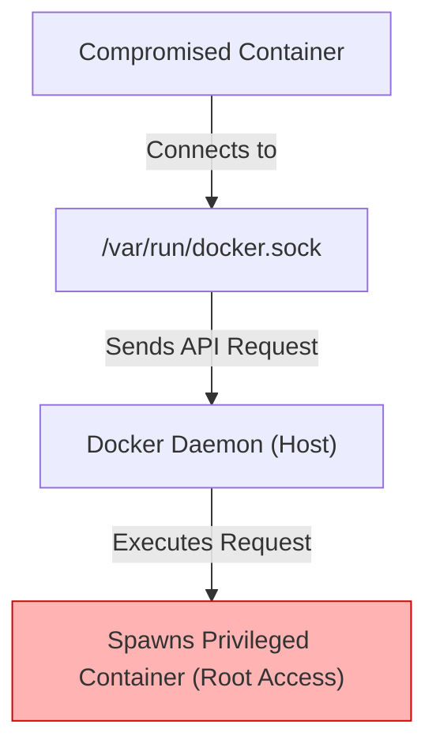

### Mitigation Architecture
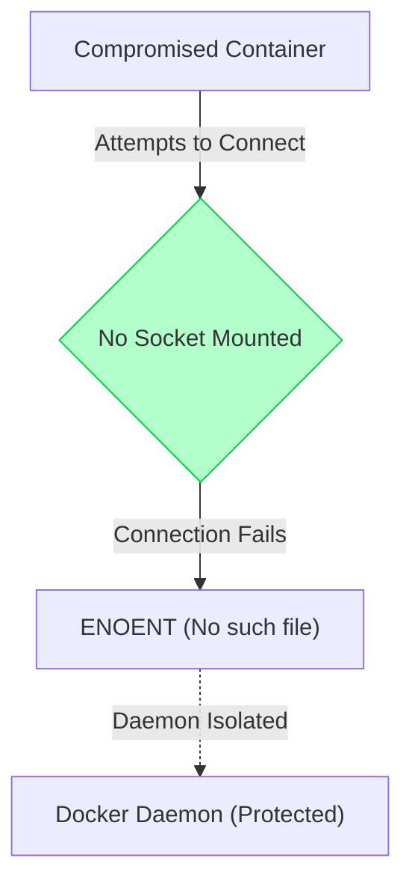

---

## Stage 4: Persistent Mounts & Filesystem
**Mechanism:** Exploits a writable host directory (e.g., `/etc/cron.d`) mounted into the container to achieve remote code execution on the host.

### Attack Architecture
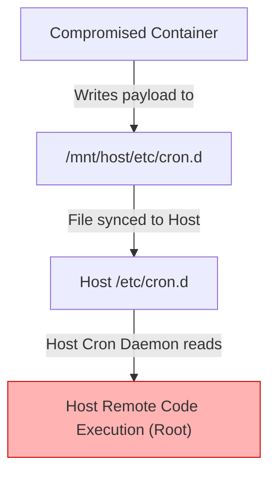

### Mitigation Architecture
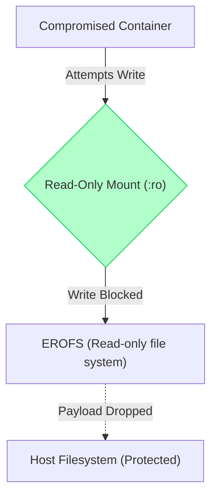

---

## Stage 5: MITRE ATT&CK Matrix Visualization
**Mechanism:** Proves that 1 vulnerability mechanism can result in 4 distinct MITRE Tactics, mitigated by 4 D3FEND Techniques.

### 4x4 Threat Model Architecture
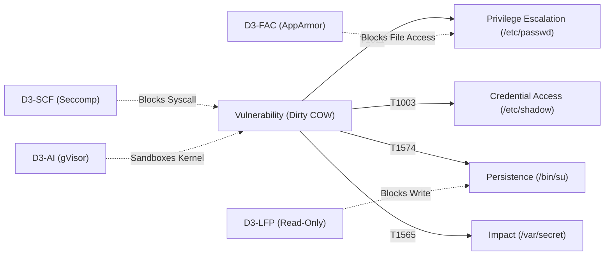
