# Hexa Force: Architecture & Mitigation Handbook

This document provides visual architectural sequence diagrams for all 9 stages of the Hexa Force Containment Lab. 
Sequence diagrams are used to illustrate the precise chronological order of system calls, thread execution, and kernel subsystem interactions that lead to container escapes, as well as the exact interception points of the Hexa Force mitigation architecture.

---

## Stage 1: Dirty COW (CVE-2016-5195)
**Mechanism:** Exploits a race condition in the page cache using the `madvise` system call.

### Attack Architecture
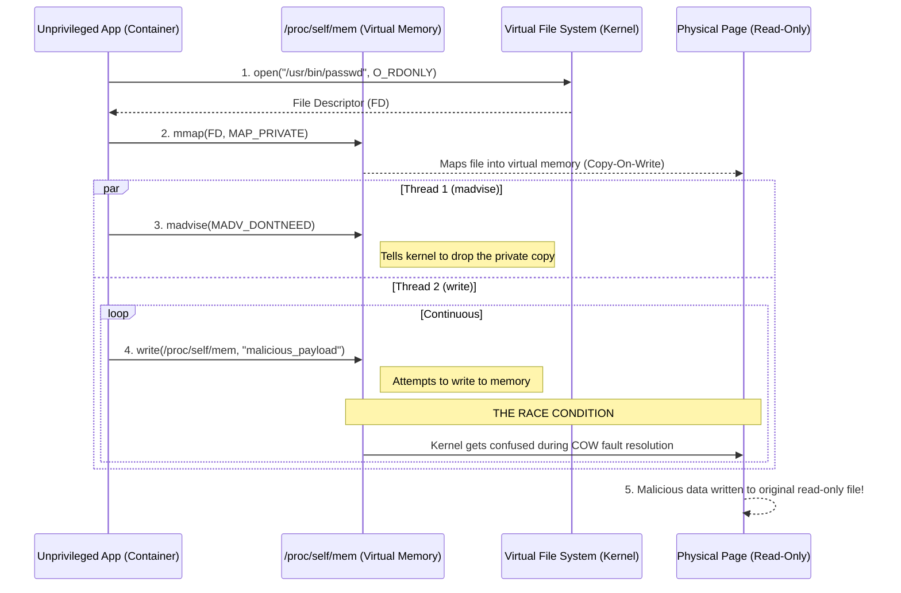

### Mitigation Architecture
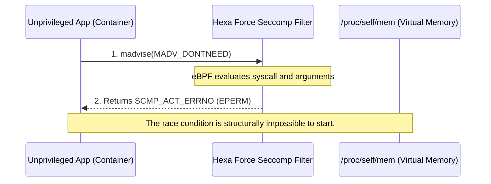

---

## Stage 1B: Dirty Pipe (CVE-2022-0847)
**Mechanism:** Exploits uninitialized pipe flags using the `splice` system call.

### Attack Architecture
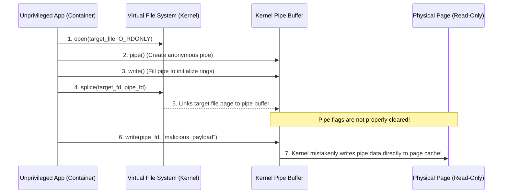

### Mitigation Architecture
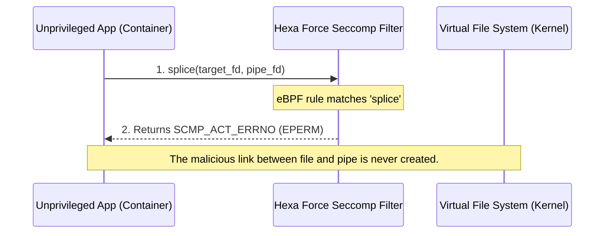

---

## Stage 1C: Copy Fail (CVE-2026-31431)
**Mechanism:** Exploits cryptographic subsystems using `AF_ALG` sockets.

### Attack Architecture
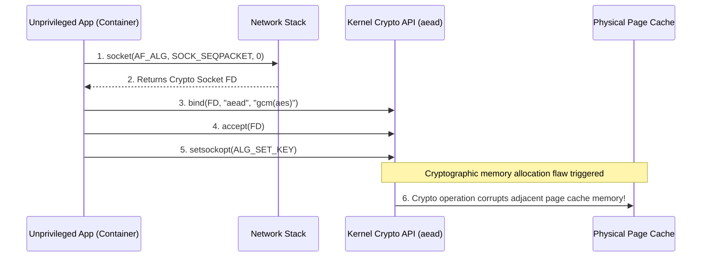

### Mitigation Architecture
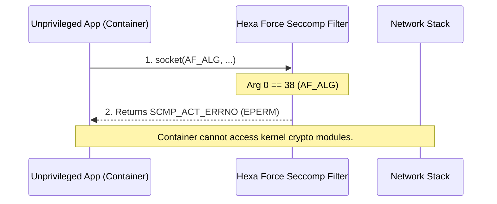

---

## Stage 1D: Dirty Frag (CVE-2026-43284)
**Mechanism:** Exploits IPv6 fragmentation logic via raw sockets.

### Attack Architecture
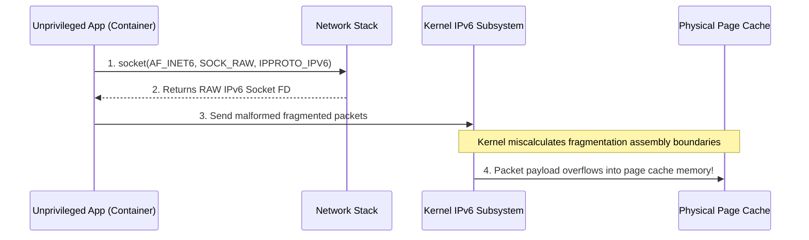

### Mitigation Architecture
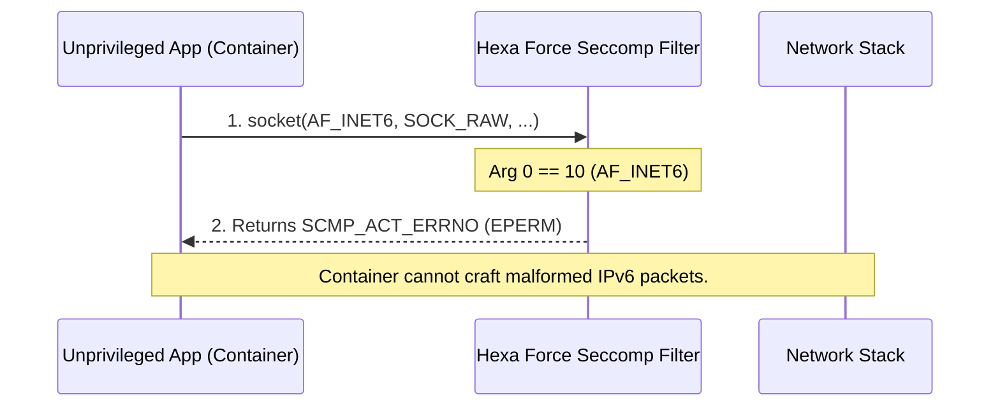

---

## Stage 1E: Fragnesia (CVE-2026-46300)
**Mechanism:** Exploits the ESP-in-TCP Upper Layer Protocol subsystem.

### Attack Architecture
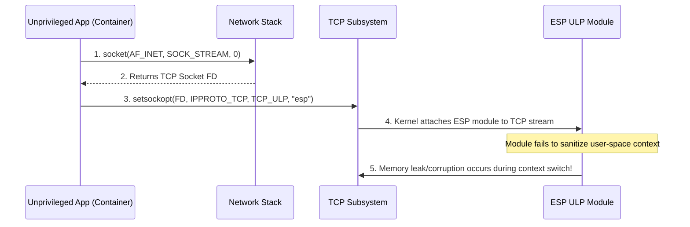

### Mitigation Architecture
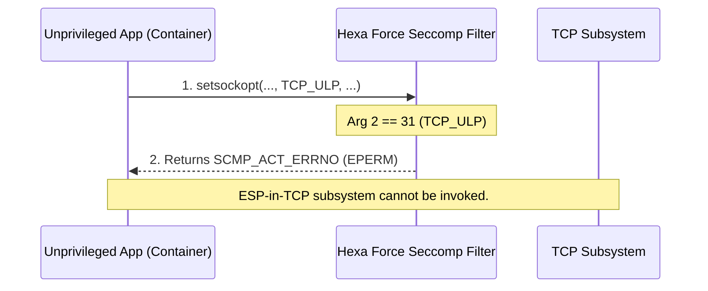

---

## Stage 2: Namespace & Capabilities Isolation
**Mechanism:** Exploits excessive privileges (`CAP_SYS_PTRACE`, `--pid=host`) to inject code.

### Attack Architecture
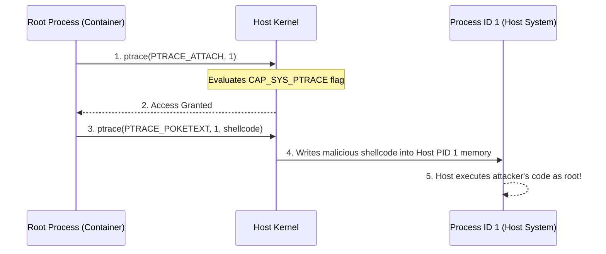

### Mitigation Architecture
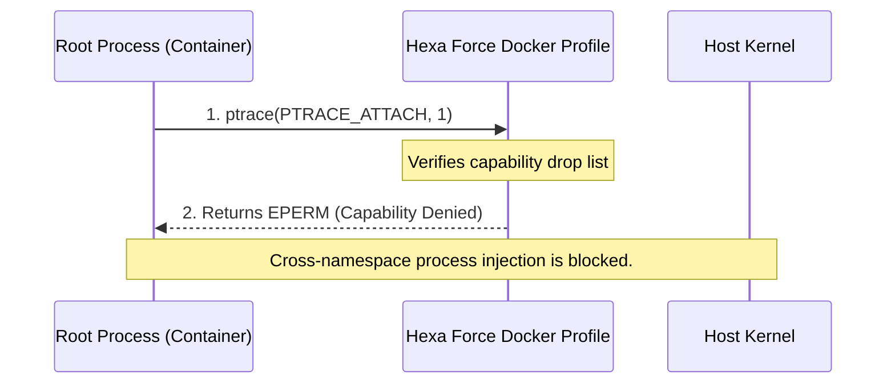

---

## Stage 3: Daemon API Security
**Mechanism:** Exploits an exposed `/var/run/docker.sock` to hijack the host daemon.

### Attack Architecture
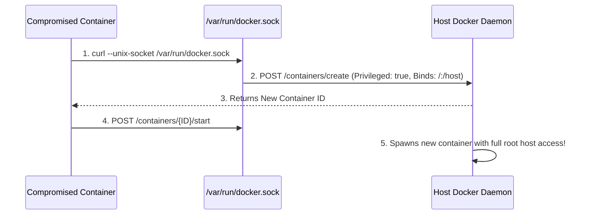

### Mitigation Architecture
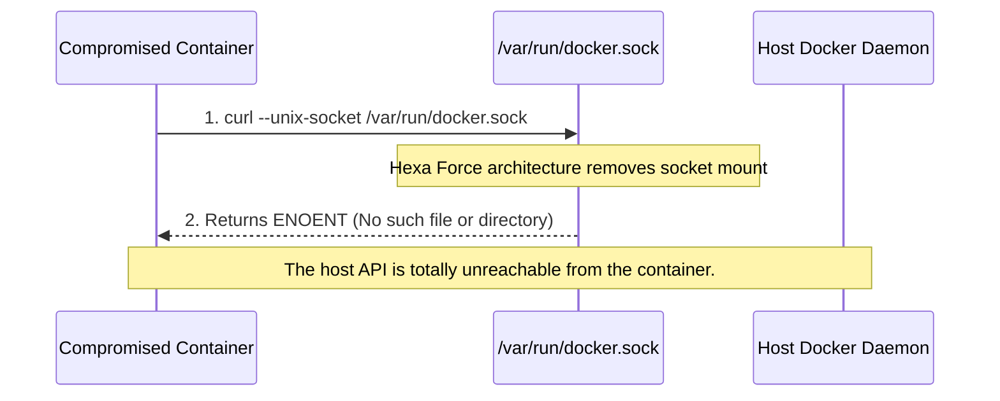

---

## Stage 4: Persistent Mounts & Filesystem
**Mechanism:** Exploits a writable host directory (e.g., `/etc/cron.d`) mounted into the container.

### Attack Architecture
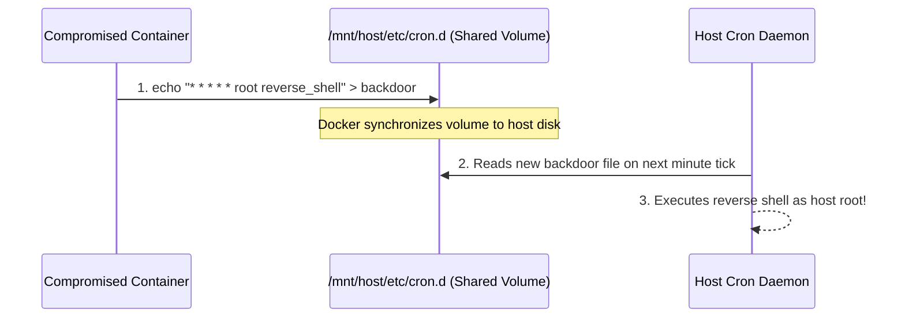

### Mitigation Architecture
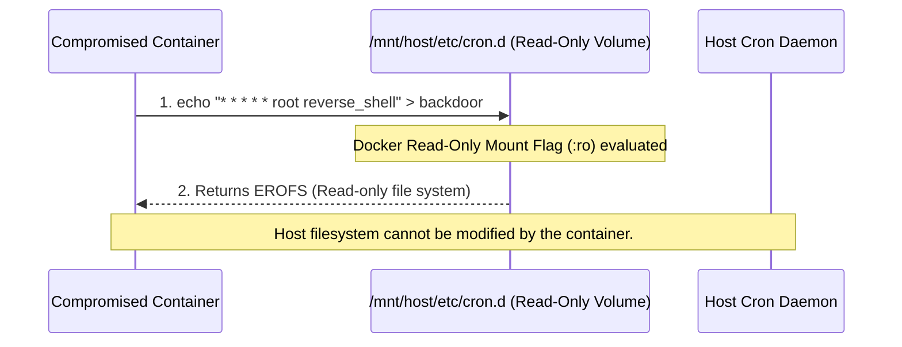

---

## Stage 5: MITRE ATT&CK Matrix Visualization
**Mechanism:** 1 Vulnerability Mechanism -> 4 Distinct Attack Tactics.

### 4x4 Threat Model Architecture
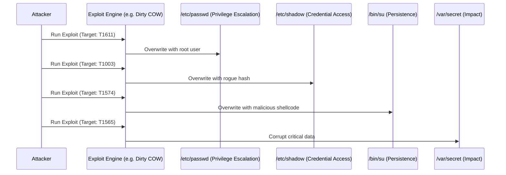
