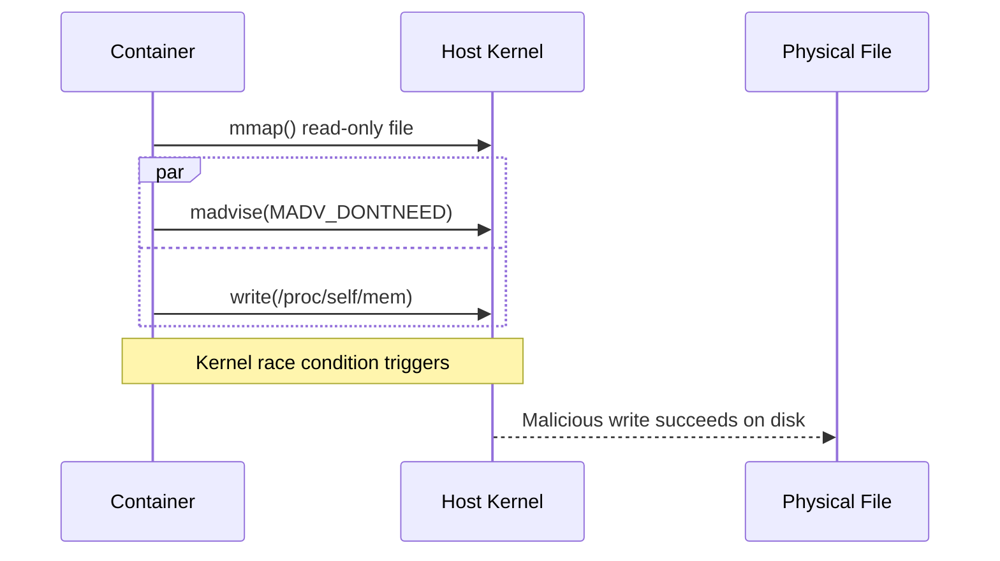
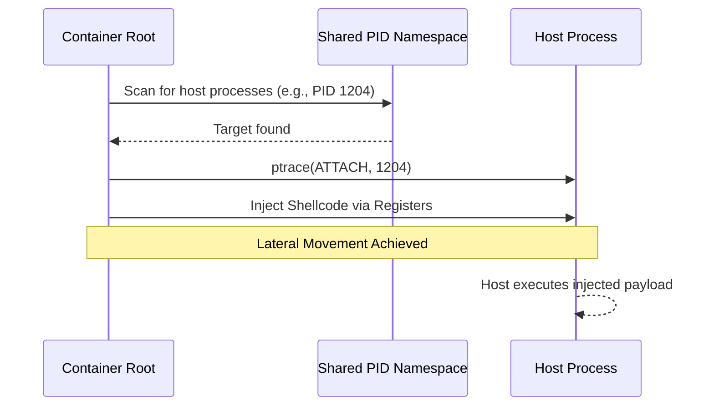
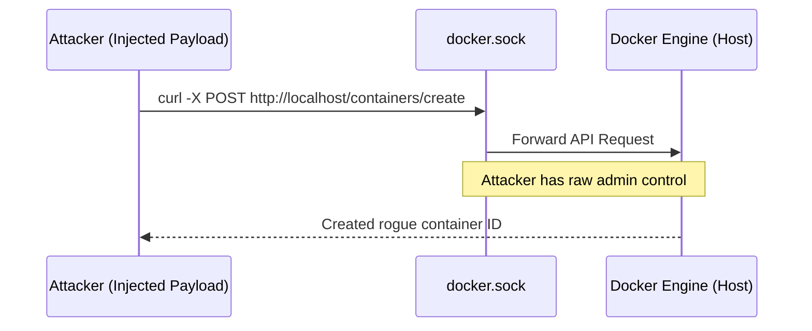
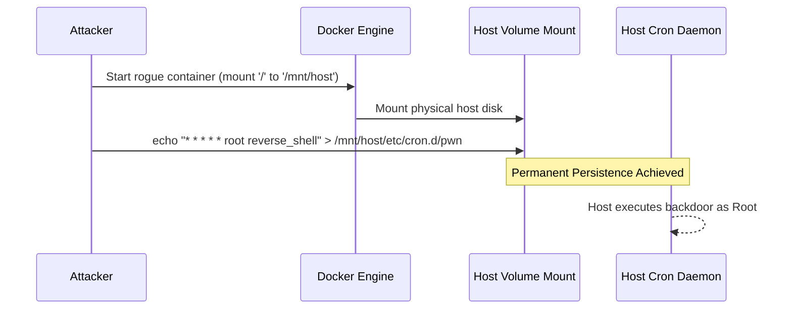
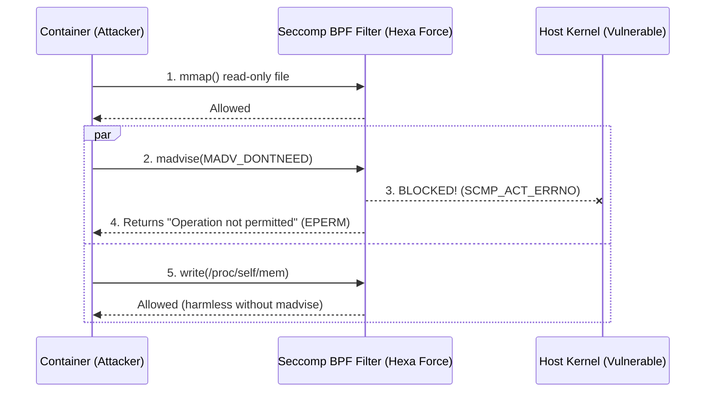
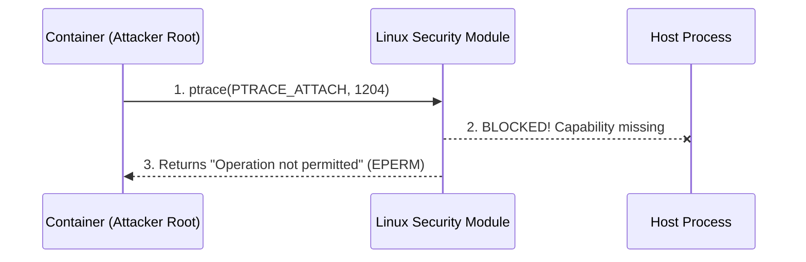

# Hexa Force: Complete Architecture Deep Dive

This document serves as a comprehensive reference guide for the Hexa Force architecture, detailing the 4-stage cascading failure of container isolation (The Attack) and the corresponding 8-layer defense-in-depth strategy (The Mitigation).

---

## Part 1: The Attack Architecture (Cascading Failure)

### Stage 1: The Kernel Exploit (Dirty COW)
**Vulnerability:** CVE-2016-5195 (Host Kernel Copy-on-Write bug)

The attacker maps a read-only system file into virtual memory. By concurrently calling `madvise(MADV_DONTNEED)` and writing to `/proc/self/mem`, the host kernel gets confused during the memory fault and accidentally writes the malicious payload directly to the physical, read-only file on disk. This grants the attacker root privileges *inside* the container.

### Stage 2: Process Injection (Namespace Bypass)
**Vulnerability:** Shared PID Namespace & `CAP_SYS_PTRACE`

With container-root achieved, the attacker leverages the shared PID namespace to "see" processes running on the underlying host. Using the `CAP_SYS_PTRACE` capability, the attacker injects malicious shellcode directly into the memory space of a privileged host daemon. The payload now executes on the host, escaping the container boundary.

### Stage 3: Docker Daemon API Hijacking
**Vulnerability:** Exposed `/var/run/docker.sock`

The attacker discovers the host's Docker Unix socket is mounted inside the container. This socket is the raw HTTP API for the entire Docker engine. By sending crafted POST requests to this socket using `curl`, the attacker gains full administrative control over the host's container orchestrator.

### Stage 4: Persistent Host Takeover (Filesystem Pivot)
**Vulnerability:** Writable Host Mounts

Using the hijacked API from Stage 3, the attacker commands the Docker engine to spawn a new "sibling" container. Crucially, they configure this new container to mount the physical host's root directory (`/`) directly into the container. The attacker then writes a reverse shell script into the host's cron daemon folder. The physical host blindly executes this script, granting permanent control over the bare-metal server.

---

## Part 2: The Mitigation Architecture (Hexa Force)

### Stage 1 Mitigation: Seccomp eBPF Filtering
**Action:** Injecting a Secure Computing (Seccomp) profile into the kernel's eBPF engine.

When the attacker attempts the Dirty COW exploit, the eBPF engine intercepts the `madvise` system call before it reaches the kernel's memory manager. The eBPF filter instantly drops the request, returning an `EPERM` error. The race condition is mathematically impossible to trigger.

### Stage 2 Mitigation: Capability Dropping
**Action:** Enforcing Principle of Least Privilege via `--cap-drop=ALL`.

The Linux Security Module (LSM) intercepts the attacker's `ptrace()` call. It checks the container's capability bounding set and sees that `CAP_SYS_PTRACE` is missing. The LSM kills the system call, preventing the attacker from debugging or injecting code into host processes. Lateral movement is severed.

### Stage 3 Mitigation: Socket Isolation
**Action:** Strictly forbidding the mounting of `/var/run/docker.sock`.

Because the container is trapped in its own isolated Mount Namespace, it cannot see the host's `/var/run` directory. The Docker API is physically invisible and inaccessible. The attacker cannot hijack the orchestration engine.

### Stage 4 Mitigation: Immutable Filesystems
**Action:** Deploying containers with the `--read-only` flag.

Even if the attacker somehow leverages a zero-day to mount the host disk, the kernel's Virtual File System (VFS) enforces the read-only flag. When the attacker attempts to write their cron backdoor, the VFS blocks the write at the lowest level, returning an `EROFS` (Read-only file system) error. Persistence is denied, and the host remains completely sterile.

---

## Appendix: The Role of eBPF

**eBPF (Extended Berkeley Packet Filter)** operates as a lightning-fast virtual machine embedded directly inside the host Linux Kernel. 

In the Hexa Force architecture, Docker translates our `hexaforce-seccomp.json` mitigation profile into eBPF bytecode. This bytecode is loaded into the kernel and intercepts system calls in microseconds. This allows us to surgically patch the Dirty COW vulnerability in real-time, at the kernel level, *without* rebooting the server and *without* breaking any other containers running on the same host.
