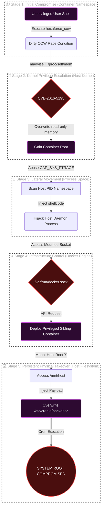

<div align="center">

#  Hexa Force
**Advanced Container Security & Containment Architecture Lab**

[](#)
[](#)
[](#)
[](#)

*School of Artificial Intelligence and Data Science, Indian Institute of Technology Jodhpur (IITJ)*  
**Authors:** Hexa Force Core Engineering Team (G25ait2026)

</div>

---

##  Overview

Hexa Force is an **educational integration study and instrumented containment framework** designed for shared-kernel container environments. It models a complete four-stage container breakout exploit chain and demonstrates the efficacy of multi-layered defense mechanisms, including surgical system call filtering (Seccomp BPF) and kernel capability dropping.

### Environment & Threat Model Justification
> *"To explain the modern **Dirty Pipe (CVE-2022-0847)** and classic **Dirty COW (CVE-2016-5195)** container escapes, this lab uses an **Ubuntu 20.04** container environment. The theoretical threat model assumes a vulnerable underlying host kernel (such as the Linux `5.15` series prior to `5.15.25` for Dirty Pipe, or `< 4.8.3` for Dirty COW). By demonstrating these exploits, we prove that our Hexa Force architecture can physically trap an attacker inside a container, even if the underlying bare-metal host is running a critically vulnerable kernel."*

This repository accompanies the IEEE-format research paper:  
>  *"Securing Shared-Kernel Runtimes Against Kernel-Level Container Escapes."*
---

##  The 4-Stage Threat Model

The lab simulates a cascading privilege escalation chain, moving from an unprivileged container process to persistent physical host control.



### Attack Vector Analysis Matrix

| Stage | Security Boundary Defeated | Exploit Technique (The "How") | Impact (The "So What?") | Educational Takeaway (The "Why") |
| :---: | :--- | :--- | :--- | :--- |
| **01** | **Kernel Memory Isolation** | Copy-on-Write (COW) Race Condition (CVE-2016-5195) | **Privilege Escalation:** Attacker gains root inside the container by overwriting read-only system files. | Containers share the host kernel. A kernel-level vulnerability instantly bypasses container boundaries. |
| **02** | **Process Isolation (Namespaces)** | Capability Abuse (`CAP_SYS_PTRACE`) across shared PID namespaces | **Lateral Movement:** Attacker hijacks and injects code into other processes running on the host machine. | Granting excessive Linux capabilities (like `SYS_PTRACE`) breaks logical process isolation. Principle of Least Privilege was violated. |
| **03** | **API & Management Surface** | Hijacked Unix Daemon Socket (`/var/run/docker.sock`) | **Infrastructure Control:** Attacker can deploy rogue, malicious sibling containers or delete existing ones. | Mounting the Docker socket exposes the entire container engine API. It is equivalent to handing over root access. |
| **04** | **Filesystem Integrity** | Writable Host Mount Escalation (`/mnt/host`) | **Total Persistence:** Attacker installs a permanent backdoor (cron job) directly onto the physical host server. | Blindly trusting and mounting writable host directories allows attackers to easily pivot from the container to the physical host filesystem. |

---

##  Core Architectural Components

###  1. Hexa Force COW Analysis Tool (`hexaforce_cow.c`)
An independently engineered, multi-mode analysis framework for the CVE-2016-5195 race condition. Unlike simple exploit scripts, this tool provides quantitative telemetry:
- `--probe`: Non-destructive vulnerability fingerprinting
- `--exploit`: Controlled race trigger with nanosecond-resolution timing telemetry
- `--verify`: Post-exploitation forensic integrity checking
- `--benchmark`: Statistical race window analysis (success rates, timings)

> **Attribution:** The fundamental race condition technique (madvise + /proc/self/mem) was first publicly documented by Phil Oester in 2016 at dirtycow.ninja.

###  2. Multi-Layer Seccomp Profile (`hexaforce-seccomp.json`)
An original, surgical **8-layer Seccomp BPF profile** that neutralizes the Dirty COW race vector by blocking `madvise` and prevents namespace/filesystem escapes by restricting `ptrace`, `unshare`, and `mount`.

###  3. Empirical Benchmark Suite (`benchmark.sh`)
A utility script that measures the actual performance overhead of the deployed security controls, producing CSV-formatted empirical data on:
- Container startup latency
- Exploit containment success rates
- Trivy scan operational durations

###  4. Sigstore CI/CD Supply Chain Verification
A GitHub Actions workflow (`.github/workflows/dirtycow-lab.yml`) demonstrating automated DevSecOps practices: AquaSec Trivy vulnerability scanning and keyless container signing via Sigstore Cosign and GitHub Actions OIDC.

---

##  Usage Guide

### Build the Lab Environment
```bash
docker build -t dirtycow-lab .
```

### Run the Interactive Demo
The orchestration script (`run_demo.sh`) guides you through all four attack stages and their corresponding mitigations in an automated workflow.
```bash
docker run -it --rm \
  -v /var/run/docker.sock:/var/run/docker.sock \
  --cap-add=SYS_PTRACE --pid=host \
  dirtycow-lab
```

### Run the Benchmark Suite
To generate statistical data on the performance overhead of the various security mechanisms:
```bash
docker run -it --rm -v /var/run/docker.sock:/var/run/docker.sock dirtycow-lab ./benchmark.sh
```

---

## ⚠️ Security Notice & Ethics

> [!CAUTION]
> This repository contains active exploit code and deliberately vulnerable configurations (e.g., exposed sockets, shared PID namespaces). 
> **DO NOT run these commands on production systems, public clouds, or un-sandboxed environments.** 
> The tools provided here are strictly for educational and academic research purposes within isolated lab environments. The authors assume no liability for misuse.
